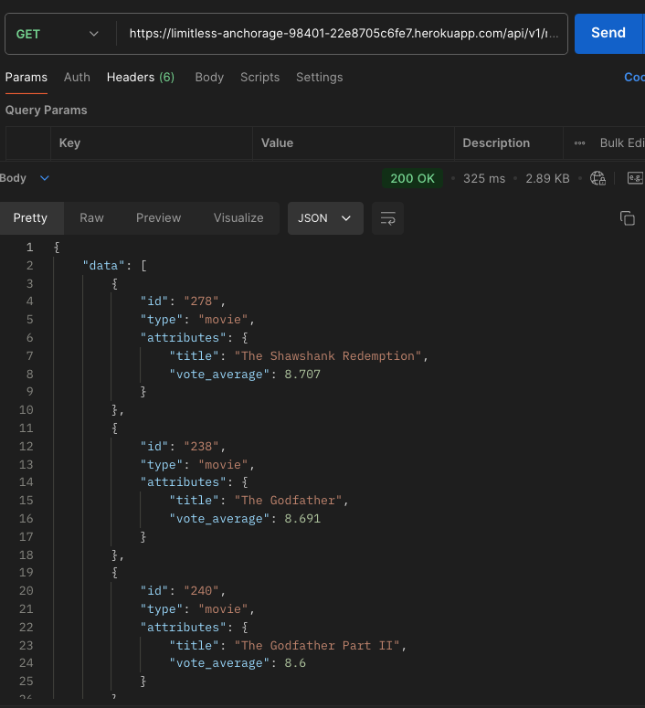

# Viewing Part API - Solo Project

[Viewing Party repo](https://github.com/jimmacur/viewing-party-api)
[Heroku Deployment](https://limitless-anchorage-98401-22e8705c6fe7.herokuapp.com/)

## About this Application

Viewing Party is an application that allows users to explore movies and create a Viewing Party Event that invites users and keeps track of a host. This application collects relevant information about movies from an external API, provide CRUD functionality for creating a Viewing Party and restrict its use to only verified users. 

## Setup

1. Fork and clone the repo
2. Install gem packages: `bundle install`
3. Setup the database: `rails db:{drop,create,migrate,seed}`

Run the application and test out some endpoints on postman: `rails s`

## App Preview

## Context

This was a solo project completed over the course of one week, building off an existing backend repository. The project involves the implementation of functionality for users to explore movies, create viewing parties, and manage invitations, leveraging The Movie DB API for movie data.

Key Features

- Top Rated Movies: Endpoint to retrieve a list of top-rated movies from The Movie DB API.
-	Movie Search: Allows users to search for movies by title and returns relevant results.
-	Movie Details: Retrieves details for a single movie, including its cast and reviews, providing users with comprehensive information.	
-	Create Viewing Party: Functionality for users to create a viewing party, specifying movie details, party time, and invitees.
-	Invite Users to Viewing Party: Allows the host to invite existing users to a viewing party.
-	User Profile: Endpoint to return a user’s profile, including their hosted and invited viewing parties.

Technologies Used

-	Ruby on Rails: Backend framework used to build out the API functionality.
-	The Movie DB API: External API used for movie data such as top-rated movies, search results, and individual movie details.

## Learning Goals
- Consume an API that requires authentication
- Build some CRUD functionality for a many-to-many relationship
- Utilize at least one mocking tool for testing API consumption
- Implement authorization for endpoints
- Explore and build off existing code in a legacy codebase
- Organize and refactor new code to be more maintainable

## Wins and Challenges
This project came with some great wins and a few challenges along the way. A big win was successfully hooking up The Movie DB API to pull in top-rated movies, let users search for films, and fetch detailed info about individual movies, including the cast and reviews. It was really rewarding to build the features for creating viewing parties and managing invites, making it easy for users to connect and enjoy movies together.

On the flip side, I faced some challenges, too. Making sure only the host could invite users to a party and checking that the users actually existed during the invite process required a lot of attention to detail. Plus, managing user authentication and securing API requests with individual API keys added a layer of complexity, especially when it came to keeping data access safe and sound. But tackling these challenges definitely helped me learn a lot about API development and user management in Rails apps!